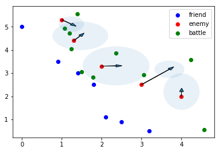

# Bayes-torch: A light weight bayes inference framework

Though there're a lot of bayes inference modeling lib/language
such as stan,edward(tensorflow) and pymc(theano), the relation between
their computation ground and absract high API is awkward.

So the project is found to implment stan-like API on the flexible
autograd library, pytorch. Tt's a light-weight framework, you will
directly write joint likelihood function to run inference instead of
fake sampling statment in stan, pymc or ugly style in Edward.

## Example

We can implement following stan model as such:

```
data {
    int<lower=1> N;
    real y[N];
}
parameters {
    real mu;
}
model {
    y ~ normal(mu, 1);
}
```

torch-bayes model code:

```
mu = Parameter(0.0) # optimizing/vb/sampling init value
sigma = Data(1.0)
X = Data(_X)

def target():
    target = norm_log_prob(X,mu,sigma).sum()
    return target
```

Full code comparing two framework:

```
from bayestorch.core import Parameter,Data,optimizing,vb,sampling
from bayestorch.distributions import norm_log_prob

import numpy as np

_X = np.random.random(10)
print(_X.mean(),_X.std())

# torch-bayes model

mu = Parameter(0.0)
sigma = Data(1.0)
X = Data(_X)

def target():
    target = norm_log_prob(X,mu,sigma).sum()
    return target

optimizing(target)
print('optimizing: mu={}'.format(mu.data.numpy()))
res = vb(target)
print('vb: mu={} omega={} sigma={}'.format(res[0],res[1],np.exp(res[1])))
trace = sampling(target)
print('sampling: mu={} sigma={}'.format(np.mean(trace), np.std(trace)))

# stan model

import pystan
stan_code = '''
data {
    int<lower=1> N;
    real y[N];
}
parameters {
    real mu;
}
model {
    y ~ normal(mu, 1);
}
'''
sm = pystan.StanModel(model_code = stan_code)
res2 = sm.optimizing(data = dict(N = len(_X), y = _X))
print('optimizing(stan): mu={}'.format(res2['mu']))
res3 = sm.vb(data = dict(N = len(_X), y = _X))
res3a=np.array(res3['sampler_params'])
print('vb(stan): mu={} sigma={}'.format(res3a[:,0].mean(),res3a[:,0].std()))


```

Enemy location detecting example:
```
# model
friend = Data(friend_point)
battle = Data(battle_point)
enemy = Parameter(enemy_point) # set real value as init value, though maybe a randomed init is more proper

conflict_threshold = 0.2
distance_threshold = 1.0
tense = 10.0

def target():
    friend_enemy = torch.cat((friend, enemy),0)
    distance = cdist(battle, friend_enemy).min(dim=1)[0]
    logPC = Data(_logPC)

    mu = Variable(torch.zeros(2,2)) 
    sd = Variable(torch.zeros(2,2))
    
    mu[0,:] = friend.mean(dim=0)
    mu[1,:] = enemy.mean(dim=0)
    sd[0,:] = friend.std(dim=0)
    sd[1,:] = enemy.std(dim=0)
    
    conflict = torch.exp(norm_naive_bayes_predict(battle, mu, sd, logPC)).prod(dim=1)
    p = soft_cut_ge(conflict,conflict_threshold, tense = tense) * soft_cut_le(distance, distance_threshold, tense = tense)
    
    target= torch.sum(torch.log(p))
    return target

def target2():
    target1 = target()
    # location prior
    target2 = target1 + 5.0*torch.sum(soft_cut_ge(enemy.sum(dim=1),5.0,tense=5))
    #target2 = target1 + torch.sum(enemy.sum(dim=1))
    return target2

```

